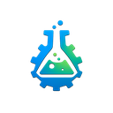

<div align="center">



# Labhaus

**实验一次，复制千次**

*Experiment. Automate. Scale.*

可视化 AI 内容生产平台 - 让专业团队批量生产 AI 视频的工作流实验室

[](https://github.com/sine-io/labhaus)
[](LICENSE)
[](https://github.com/sine-io/labhaus/pulls)

[English](README.md) · [简体中文](README.zh-CN.md) · [日本語](README.ja.md)

</div>

---

## 💡 为什么是 Labhaus？

> **"Where content experiments succeed"**  
> 内容创作不是流水线，而是实验室

大多数 AI 视频工具都在解决"如何快速生成"，但专业团队真正的痛点是：

- ❌ **单次实验成本太高** - 测试一个创意需要 2-4 小时
- ❌ **成功配方难以复制** - 风格一致性依赖人工
- ❌ **批量生产缺乏工具** - CSV 导入、并发执行、API 集成都要自己写

**Labhaus 提供的是实验平台，而不是生成工具**：

1. **实验** - 可视化工作流编辑器，快速测试创意
2. **验证** - 人工介入节点，确保质量
3. **规模化** - 一键批量复制，保持风格一致性

---

## 🎯 核心价值

### 对比主流方案

|  | MoneyPrinterTurbo | Runway | **Labhaus** |
|---|---|---|---|
| **定位** | 一键生成工具 | SaaS 平台 | **工作流实验室** |
| **目标用户** | 个人创作者 | 企业用户 | **专业团队+企业** |
| **核心能力** | 快速、简单 | 全自动 | **可视化工作流+批量** |
| **可定制性** | ⭐⭐ | ⭐⭐ | **⭐⭐⭐⭐⭐** |
| **批量能力** | ⭐⭐⭐ | ⭐ | **⭐⭐⭐⭐⭐** |
| **样式库** | ❌ | ❌ | **✅ 500+** |
| **模板市场** | ❌ | ❌ | **✅** |
| **私有部署** | ✅ | ❌ | **✅** |

### 三大独特优势

#### 1. 可视化工作流编辑器 🔥
拖拽式节点编辑，无需编程
- 输入节点：文本/URL/CSV
- 处理节点：LLM/样式选择/生图/TTS/合成
- 输出节点：下载/S3/Telegram
- 人工介入：预览、审核、修改

#### 2. 500+ GPT-Image-2 样式库
来自 [awesome-gpt-image-2](https://github.com/sine-io/awesome-gpt-image-2)
- 工业级提示词案例
- 按场景/风格分类
- 一键应用到工作流

#### 3. 模板市场（即将推出）
- 分享成功的工作流配方
- 购买/出售优质模板
- 社区驱动的网络效应

---

## 🚀 快速开始

### 前置要求

- Docker & Docker Compose
- Python 3.11+
- Node.js 20+

### 一键启动

```bash
# 克隆项目
git clone https://github.com/sine-io/labhaus.git
cd labhaus

# 启动服务
docker-compose up -d

# 访问 Web 界面
open http://localhost:3000
```

### 运行第一个工作流

1. 打开可视化编辑器
2. 选择预设模板："文章 → 视频"
3. 上传 CSV 或输入文本
4. 从样式库选择风格
5. 点击"批量执行"
6. 下载生成的视频

详细文档：[快速开始指南](docs/guides/quick-start.md)

---

## 📦 项目架构

```
labhaus/
├── backend/              # Go 后端服务
│   ├── workflow-engine/  # 工作流引擎
│   └── style-library/    # 样式库 API
├── frontend/             # React 前端
│   ├── editor/           # 🔥 可视化编辑器
│   ├── gallery/          # 样式库展示
│   └── marketplace/      # 模板市场
├── infra/                # Docker & K8s
└── docs/                 # 完整文档
```

**技术栈**：
- 前端：React + TypeScript + React Flow + TailwindCSS
- 后端：Go + PostgreSQL + Redis
- 工作流：自研状态机 + JSON Schema
- 存储：MinIO / S3

详细架构：[系统设计文档](docs/architecture/system-design.md)

---

## 🎬 典型使用场景

### 场景 1：营销团队批量生产广告素材
**痛点**：需要测试 10 种文案 × 5 种视觉风格 = 50 个视频  
**方案**：
1. CSV 导入 10 种文案
2. 工作流配置 5 种样式库风格
3. 批量生成 50 个视频
4. 人工筛选最优组合

**效果**：3 小时完成，成本降低 80%

### 场景 2：内容创作者保持风格一致性
**痛点**：手动调整每个视频的视觉风格，耗时且不一致  
**方案**：
1. 第一次实验找到最佳风格
2. 保存为工作流模板
3. 后续批量应用模板

**效果**：风格一致性 > 95%，单条时间从 4 小时 → 30 分钟

### 场景 3：开发者集成 AI 视频能力
**痛点**：从零开发需要 3-6 个月  
**方案**：
1. Docker 私有化部署
2. RESTful API 调用
3. Webhook 异步回调

**效果**：1 周完成集成，深度可定制

---

## 📊 开发路线图

### ✅ Phase 1: 基础整合（已完成）
- [x] 创建 Monorepo 结构
- [x] 样式库数据迁移
- [x] 统一 API 网关

### 🔄 Phase 2: 核心工作流（进行中）
- [ ] 样式库 API 化
- [ ] "文章 → 视频" 完整流程
- [ ] 任务监控面板

### ⏳ Phase 3: 可视化编辑器
- [ ] React Flow 节点编辑器
- [ ] 10+ 内置节点
- [ ] 人工介入和预览

### ⏳ Phase 4: 模板市场
- [ ] 模板保存/分享
- [ ] 付费模板
- [ ] 社区评分

完整路线图：[MVP 开发计划](docs/planning/mvp-roadmap.md)

---

## 💰 商业模式

### 定价方案

| 版本 | 价格 | 核心功能 |
|------|------|---------|
| **免费版** | $0 | 基础工作流、公共样式库、月生成 10 个视频 |
| **专业版** | $29/月 | 批量并发（10 并发）、私有样式库、月生成 100 个视频 |
| **企业版** | 定制 | 私有化部署、无限并发、白标服务、SLA 保障 |

### 收入来源
1. **订阅费用**（主要）
2. **模板市场分成**（30%）
3. **API 调用超额费**
4. **专业服务**（定制开发、培训）

---

## 🤝 参与贡献

项目目前处于 MVP 阶段，Beta 版本发布后将开放：

- 🐛 Bug 报告和功能建议
- 📝 文档改进
- 🎨 样式库贡献
- 🛠️ 模板市场分享

贡献指南：[CONTRIBUTING.md](CONTRIBUTING.md)

---

## 📚 文档索引

- **产品文档**：[PRD](docs/product/PRD.md) · [用户故事](docs/product/user-story-map.md)
- **调研报告**：[竞品分析](docs/research/competitive-analysis.md) · [方法论分析](docs/research/methodology-analysis.md)
- **架构设计**：[系统设计](docs/architecture/system-design.md) · [API 接口](docs/architecture/api-design.md)
- **开发指南**：[快速开始](docs/guides/quick-start.md) · [本地开发](docs/guides/local-development.md)

---

## 📄 许可证

本项目采用 [GNU Affero General Public License v3.0](LICENSE) 开源协议

---

## 📧 联系我们

- **项目主页**：https://github.com/sine-io/labhaus
- **Issues**：https://github.com/sine-io/labhaus/issues
- **Discussions**：https://github.com/sine-io/labhaus/discussions

---

<div align="center">

**Built with ❤️ by the Labhaus Team**

*Where content experiments succeed*

</div>
