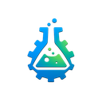

<div align="center">



# Labhaus

**实验一次，复制千次**

_Experiment. Automate. Scale._

可视化 AI 内容生产平台 - 让专业团队批量生产 AI 视频的工作流实验室

[](https://github.com/sine-io/labhaus)
[](LICENSE)
[](https://github.com/sine-io/labhaus/pulls)

</div>

---

## 当前状态

Labhaus 的长期方向仍是 **AI 视频工作流实验室**：用可视化工作流、样式库和批量执行能力，把一次成功的内容实验复制到更多素材和视频中。

当前代码已经收敛到第一个可运行 MVP：

1. **认证**：用户注册、登录、Bearer Token 保护 API。
2. **样式推荐**：用户输入创意描述，后端基于当前样式数据返回匹配样式。
3. **批量生图**：用户提交多条 prompt，后端调用配置的图像 Provider，结果写入 MinIO 并返回预签名下载链接。
4. **本地演示闭环**：Docker Compose 提供 PostgreSQL、Redis、MinIO、Go API 和本地 mock image provider。

当前 MVP **不包含**：文章解析、TTS、FFmpeg 视频合成、React Flow 可视化编辑器、模板市场。这些仍是后续视频工作流阶段目标。

## 当前主线

- **后端**：`backend/` Go API（Gin + PostgreSQL + Redis + MinIO）
- **前端**：`apps/web/` Next.js App Router
- **包管理**：pnpm workspace + Turborepo
- **本地演示**：`docker-compose.yml` 启动 API 依赖和 mock image provider；Web 前端单独运行

早期 TypeScript API、共享包和执行报告类文档已移除。如需参考旧实现，请从 git history 查看。

## 为什么是 Labhaus？

大多数 AI 视频工具都在解决“如何快速生成单条内容”，但专业团队真正的痛点是：

- 单次实验成本高：测试一个创意需要反复调 prompt、调风格、调生成参数。
- 成功配方难复制：风格一致性依赖人工记忆和复制粘贴。
- 批量生产缺工具：CSV 导入、并发执行、API 集成、素材管理通常要自己写。

Labhaus 的定位不是一次性生成器，而是内容实验室：

1. **实验**：快速验证创意、视觉风格和生成参数。
2. **复用**：把可行的样式和 prompt 作为后续工作流输入。
3. **规模化**：批量生成素材，后续扩展为批量视频工作流。

## 快速开始

### 前置要求

- Docker 和 Docker Compose
- Node.js 20+
- pnpm 11（仓库当前锁定 `pnpm@11.8.0`）
- Go 1.25+（仅裸跑 Go API 或运行 Go 测试时需要）

### 启动本地 MVP

```bash
git clone https://github.com/sine-io/labhaus.git
cd labhaus

# 启动 PostgreSQL、Redis、MinIO、mock image provider 和 Go API
docker compose up -d --build

# 导入本地 demo 样式数据（当前 seed 为 12 条，后续目标是接入 500+ 样式库）
docker compose exec -T postgres psql -U labhaus -d labhaus < backend/seeds/styles.sql

# API 启动时会加载样式快照；导入 seed 后需要重启 API
docker compose restart api

# 启动 Next.js 前端
pnpm install
cp apps/web/.env.example apps/web/.env.local
pnpm --filter @labhaus/web dev
```

访问：

- Web: http://localhost:3000
- API: http://localhost:8080
- MinIO Console: http://localhost:9001
- Mock Image Provider: http://localhost:8089

### 一键 Smoke

```bash
scripts/mvp-smoke.sh
```

脚本会依次执行健康检查、注册/登录、样式推荐和批量生图。

## 当前 API 概览

所有受保护端点使用：

```http
Authorization: Bearer <token>
Content-Type: application/json
```

主要端点：

| 能力             | 方法与路径                   |
| ---------------- | ---------------------------- |
| 健康检查         | `GET /api/health`            |
| 注册             | `POST /api/users/register`   |
| 登录             | `POST /api/users/login`      |
| 当前用户         | `GET /api/users/me`          |
| 样式列表         | `GET /api/styles`            |
| 样式推荐         | `POST /api/styles/recommend` |
| 创建工作流元数据 | `POST /api/workflows`        |
| 批量生图         | `POST /api/images/generate`  |

完整契约见 [API 设计文档](docs/architecture/api-design.md)。

## 项目结构

```text
labhaus/
├── apps/
│   └── web/                         # Next.js 前端
├── backend/                         # Go 后端服务
│   ├── cmd/api/                     # API 入口
│   ├── cmd/mock-image-provider/     # 本地 demo 图像 Provider
│   ├── internal/
│   │   ├── application/             # CQRS handlers 和 DTO
│   │   ├── domain/                  # User/Style/Workflow/Image Provider 领域模型
│   │   └── infrastructure/          # HTTP、持久化、队列、存储、Provider 适配
│   └── seeds/styles.sql             # 本地 demo 样式 seed
├── docs/                            # 当前产品、架构、开发和部署文档
├── scripts/mvp-smoke.sh             # MVP API smoke 脚本
└── docker-compose.yml               # 本地依赖和 Go API 编排
```

## 技术栈

- 前端：Next.js 16、React 19、TypeScript、Tailwind CSS 4
- 后端：Go 1.25、Gin、GORM、PostgreSQL 16、Redis 7、MinIO
- 认证：JWT Bearer Token、bcrypt
- 图像 Provider：兼容 `POST /v1/generate` 的 HTTP Provider；本地使用 mock image provider
- 测试：Node built-in test runner、TypeScript typecheck、Go testing/testify

## 路线图

### 已实现：图像素材 MVP

- [x] Go 后端 + Next 前端主线
- [x] 用户注册/登录和 Bearer Token
- [x] 认证后的样式推荐
- [x] 认证后的批量生图
- [x] MinIO 存储和预签名下载链接
- [x] 本地 mock image provider 和 smoke 脚本

### 下一阶段：视频工作流

- [ ] “文章/文本 -> 分镜 -> 生图 -> TTS -> FFmpeg 合成 -> MP4”闭环
- [ ] 任务监控页面和执行日志
- [ ] 失败重试、进度追踪和中间产物预览

### 后续阶段

- [ ] React Flow 可视化工作流编辑器
- [ ] 500+ 样式库导入与推荐优化
- [ ] 模板保存、分享和市场化
- [ ] 团队协作、配额、计费和私有化部署能力

## 文档索引

- 产品：[PRD](docs/product/PRD.md) · [用户故事地图](docs/product/user-story-map.md)
- 架构：[系统设计](docs/architecture/system-design.md) · [API 设计](docs/architecture/api-design.md) · [Go DDD 架构](docs/architecture/GO_DDD_ARCHITECTURE.md)
- 开发：[快速开始](docs/guides/quick-start.md) · [本地开发](docs/guides/local-development.md) · [技术栈](docs/TECH_STACK.md)
- 部署：[部署指南](docs/DEPLOYMENT.md)

## 贡献

参考 [CONTRIBUTING.md](CONTRIBUTING.md)。

## 许可证

本项目采用 [GNU Affero General Public License v3.0](LICENSE) 开源协议。

---

<div align="center">

_Where content experiments succeed_

</div>
